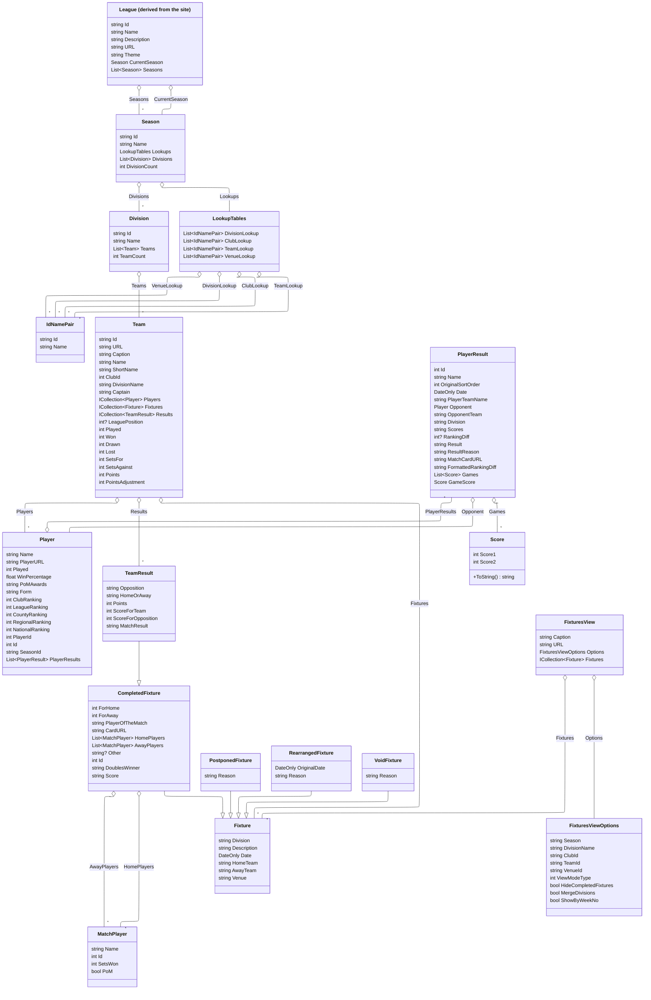

# Smab.TTInfo.TT365

A .NET library for accessing and summarizing table tennis league data from the [Table Tennis 365 (TT365)](https://www.tabletennis365.com) platform. This library provides services for retrieving league, team, player, and fixture information, with support for caching, CSV/iCal export, and flexible configuration.

## Features
- Retrieve league, team, player, and fixture data from TT365
- Caching support to reduce API calls
- Generate CSV and iCal (calendar) exports from fixture data
- Strongly-typed models for TT365 entities
- Easily configurable via dependency injection and options

## Installation
Add a reference to the project or install via NuGet (if available):

```
dotnet add package Smab.TTInfo.TT365
```

## Usage
1. **Register the service in your DI container:**

```csharp
services.AddTT365Service();
```

2. **Inject and use `ITT365Reader` in your application:**

```csharp
public class MyService
{
    private readonly ITT365Reader _reader;
    public MyService(ITT365Reader reader) => _reader = reader;

    public async Task<List<Fixture>> GetFixtures(string leagueId)
        => await _reader.GetAllFixtures(leagueId);
}
```

## Configuration
You can configure TT365 options (such as cache folder, cache duration, and test file usage) via configuration or code:

```json
"TT365Options": {
  "CacheFolder": "./cache",
  "CacheHours": 12,
  "UseTestFiles": false
}
```

Or in code:

```csharp
services.AddTT365Service(options => {
    options.CacheFolder = "./cache";
    options.CacheHours = 12;
    options.UseTestFiles = false;
});
```

## Main Components
- `ITT365Reader` / `TT365Reader`: Main service for accessing TT365 data
- `TT365Options`: Configuration options for the service
- Models: Strongly-typed representations of leagues, teams, players, fixtures, etc.
- Utility methods for CSV/iCal export

## Project Structure
- `Services/`: Service interfaces and implementations
- `Models/`: Data models for TT365 entities
- `AddTT365Service.cs`: Extension methods for DI registration

## Relational Models Class Diagram

Below is a class diagram showing all types in the `Smab.TTInfo.TT365.Models.TT365` namespace and their relationships:



 
## License
See repository for license details.
