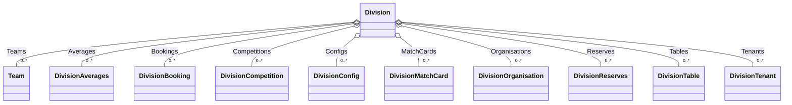

# Smab.TTInfo.TTLeagues

A .NET library for accessing and summarizing table tennis league data from the [TTLeagues](https://www.ttleagues.com) platform. This library provides services for retrieving league, team, player, and fixture information, with support for caching and flexible configuration.

## Features
- Retrieve league, team, player, and fixture data from TTLeagues
- Caching support to reduce API calls
- Strongly-typed models for TTLeagues entities
- Easily configurable via dependency injection and options

## Installation
Add a reference to the project or install via NuGet (if available):

```
dotnet add package Smab.TTInfo.TTLeagues
```

## Usage
1. **Register the service in your DI container:**

```csharp
services.AddTTLeaguesService();
```

2. **Inject and use `TTLeaguesReader` in your application:**

```csharp
public class MyService
{
    private readonly TTLeaguesReader _reader;
    public MyService(TTLeaguesReader reader) => _reader = reader;

    // Example usage
    public async Task DoSomethingAsync()
    {
        // Use _reader to access TTLeagues data
    }
}
```

## Configuration
You can configure TTLeagues options (such as cache folder, cache duration, and test file usage) via configuration or code:

```json
"TTLeaguesOptions": {
  "CacheFolder": "./cache",
  "CacheHours": 12,
  "UseTestFiles": false
}
```

Or in code:

```csharp
services.AddTTLeaguesService(options => {
    options.CacheFolder = "./cache";
    options.CacheHours = 12;
    options.UseTestFiles = false;
});
```

## Main Components
- `TTLeaguesReader`: Main service for accessing TTLeagues data
- `TTLeaguesOptions`: Configuration options for the service
- Models: Strongly-typed representations of leagues, teams, players, fixtures, etc.

## Project Structure
- `Services/`: Service interfaces and implementations
- `Models/`: Data models for TTLeagues entities
- `AddTTLeaguesService.cs`: Extension methods for DI registration

## Relational Models Class Diagram (WIP)

Below are class diagrams showing all types in the `Smab.TTInfo.TTLeagues.Models` namespace and their relationships:


### Team and club domain


### Fixtures and matches domain


### Division domain


### Player and Stats domain


### Tenants and websites domain


### Class Diagram for All Types in Smab.TTInfo.TTLeagues.Models

```mermaid
classDiagram
    %% Core Entities
    class Club
    class Competition
    class Division
    class DivisionAverages
    class DivisionBooking
    class DivisionCompetition
    class DivisionConfig
    class DivisionMatchCard
    class DivisionOrganisation
    class DivisionReserves
    class DivisionTable
    class DivisionTenant
    class Fixtures
    class Group
    class IntKeyValue
    class Match
    class MatchGame
    class MatchPlayer
    class MatchResults
    class MatchSet
    class MatchTeamInfo
    class Member
    class Person
    class PlayerAverage
    class PlayerForm
    class PlayerGame
    class PlayerLocalRanking
    class PlayerNationalRanking
    class PlayerResult
    class PlayerScore
    class PlayerStats
    class Ranking
    class StringKeyValue
    class Team
    class TeamMember
    class TeamStanding
    class TeamStats
    class TeamStatsMatch
    class TeamStatsPlayer
    class TeamStatsResult
    class TenantsHost
    class TenantsHostBooking
    class TenantsHostCompetition
    class TenantsHostConfig
    class TenantsHostOrganisation
    class Venue
    class WebsitesHost
    class WebsitesHostConfig
    class WebsitesHostFooter
    class WebsitesHostMenu
    class WebsitesHostPage
    class WebsitesHostItem
    class WebsitesHostPrimary

    %% Example Relationships (not exhaustive, but representative)
    Team o-- Club : Club
    Team o-- Venue : Venue
    Team o-- "0..*" Person : Members
    Club o-- "0..*" Team : Teams
    Venue o-- "0..*" Club : Clubs
    Fixtures o-- "0..*" Group : Groups
    Fixtures o-- "0..*" Match : Matches
    Group o-- "0..*" Match : Matches
    Match o-- MatchTeamInfo : Home
    Match o-- MatchTeamInfo : Away
    Match o-- "0..*" PlayerScore : HomeScores
    Match o-- "0..*" PlayerScore : AwayScores
    MatchTeamInfo o-- "0..*" Member : Members
    MatchTeamInfo o-- "0..*" Member : Reserves
    Competition o-- Person : Organiser
    Division o-- "0..*" Team : Teams
    Division o-- "0..*" DivisionAverages : Averages
    Division o-- "0..*" DivisionBooking : Bookings
    Division o-- "0..*" DivisionCompetition : Competitions
    Division o-- "0..*" DivisionConfig : Configs
    Division o-- "0..*" DivisionMatchCard : MatchCards
    Division o-- "0..*" DivisionOrganisation : Organisations
    Division o-- "0..*" DivisionReserves : Reserves
    Division o-- "0..*" DivisionTable : Tables
    Division o-- "0..*" DivisionTenant : Tenants
    TeamStats o-- "0..*" TeamStatsPlayer : Players
    TeamStats o-- "0..*" TeamStatsMatch : Matches
    TeamStats o-- "0..*" TeamStatsResult : Results
    PlayerStats o-- "0..*" PlayerAverage : Averages
    PlayerStats o-- "0..*" PlayerForm : Forms
    PlayerStats o-- "0..*" PlayerGame : Games
    PlayerStats o-- "0..*" PlayerLocalRanking : LocalRankings
    PlayerStats o-- "0..*" PlayerNationalRanking : NationalRankings
    PlayerStats o-- "0..*" PlayerResult : Results
    PlayerStats o-- "0..*" PlayerScore : Scores
    PlayerStats o-- "0..*" PlayerStats : Stats
    TenantsHost o-- TenantsHostOrganisation : Organisation
    WebsitesHost o-- WebsitesHostMenu : Menu
    WebsitesHost o-- WebsitesHostConfig : Config
    WebsitesHost o-- WebsitesHostFooter : Footer
    WebsitesHost o-- WebsitesHostPage : Page
    WebsitesHost o-- WebsitesHostItem : Item
    WebsitesHost o-- WebsitesHostPrimary : Primary```
```



## License
See repository for license details.
